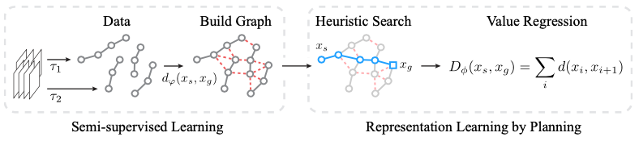

# Plan2Vec: Unsupervised Representation Learning by Latent Plans 

Official release for [Plan2Vec](https://episodeyang.github.io/plan2vec).

<p align="center"></p>


## Getting Started

> Under review, coming soon.

## BibTex

```
@inproceedings{yang2020plan2vec,
    title={Plan2vec: Unsupervised Representation Learning by Latent Plans},
    author={Yang, Ge and Zhang, Amy and Morcos, Ari S. and Pineau, Joelle
            and Abbeel, Pieter and Calandra, Roberto},
    booktitle={Proceedings of The 2nd Annual Conference on Learning for 
               Dynamics and Control},
    series={Proceedings of Machine Learning Research},
    pages={1-12},
    year={2020},
    volume={120},
    note={arXiv:2005.}
}
```

